# TeleTracker Client Area User Documentation

This document provides instructions on how to use the TeleTracker Client Area, including explanations of what each module does. Each component and configuration option is explored in detail.

## Table of Contents

- [Home Screen](#home-screen)
- [Account Module](#account-module)
- [Cloud Phone System Module](#cloud-phone-system-module)
- [Call Tracker Module](#call-tracker-module)
- [Yard Signs Module](#yard-signs-module)
- [Rapid Response Module](#rapid-response-module)

## Home Screen

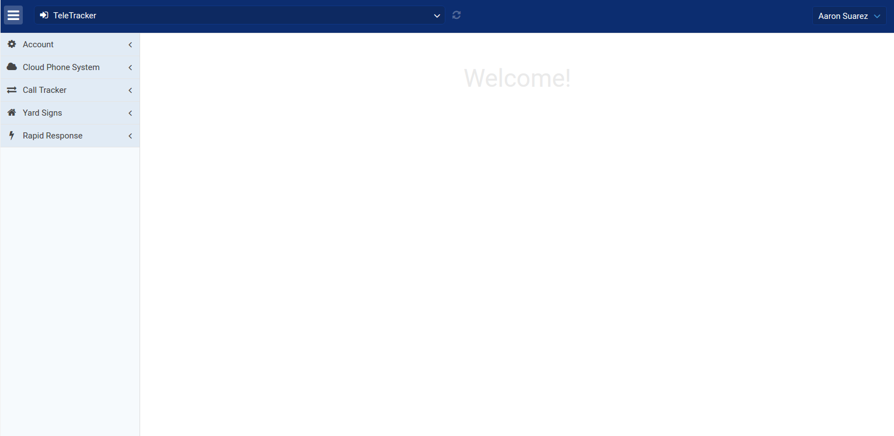

The Home Screen is composed of three main components:

* [Navigation Menu](#navigation-menu)
* [Account Switcher](#account-switcher)
* [Profile Menu](#profile-menu)

### Navigation Menu

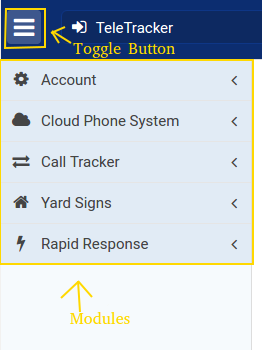

The navigation menu on the left is composed of the toggle button (for showing and hiding the menu) and a list of modules. Each module is discussed in detail below. The modules that are displayed depend on the access level of the user as well as how the account is set up. For example, Yard Signs are not relevant for all accounts, and therefore the Yard Sign Module is not displayed for those accounts.

### Account Switcher

The account switcher is a drop down menu of all the accounts associated with the currently logged in user. If the user only has one account (as in the image above), only the one account is displayed. The refresh button to the right of the dropdown refreshes the available accounts.

### Profile Menu

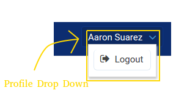

The profile menu is a dropdown. The user's name is displayed, and if they have a TeleTracker number associated with their profile, that will be displayed as well. Currently, the only option in the dropdown is to log out. More options for personal settings coming soon!

## Account Module

The account module is only visible to users with access level "Manager" or "Admin". Managers can manage account settings and users, but only Admins have the ability to manage billing information. The following parts compose the account module:

* [Account Settings](#account-settings)
* [Billing Info](#billing-info)
* [Manage Users](#manage-users)

### Account Settings

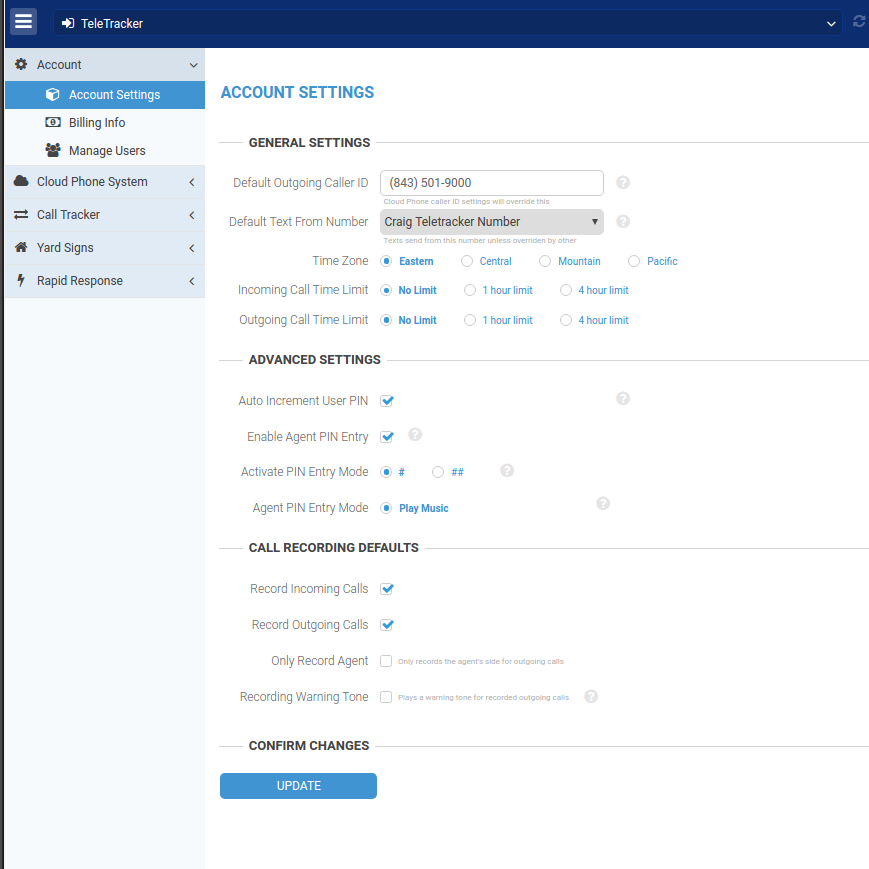

The account settings page allows users to change account wide settings. 

| Name                       | Description |
| ----                       | :---------: |
| Default Outgoing Caller Id | If an outgoing call is made from the account, this is the number the person being called will see on their caller id. Must be a valid telephone number. Settings on the line making the outgoing call will override this. |
| Default Text From Number   | If an outgoing text is made from the account, this is the number the person receiving the text will see the text coming from. Must be a TeleTracker line. Settings in the Cloud Phone System module and Yard Signs module will override this. |
| Time Zone                  | Any times that are displayed throughout the app are based on this time zone. |
| Incoming Call Time Limit   | Incoming calls will be disconnected after the specified amount of time. |
| Outgoing Call Time Limit   | Outgoing calls will be disconnected after the specified amount of time. |
| Auto Increment User PIN    | When a new user is created, a PIN will be automatically generated. |
| Enable Agent PIN Entry     | If enabled, agents will be able to enter their PIN upon recieving a call, which will associate that call with their user in the Call Tracker module. |
| Activate PIN Entry Mode    | If Agent PIN Entry is enabled, the agents will have to enter `#` or `##` before entering their PIN. |
| Agent PIN Entry Mode       | If Agent PIN Entry is enabled, the caller will hear this while the agent is entering their PIN. |
| Record Incoming Calls      | Selecting this records incoming calls. Call recordings are accessible in the Call Tracker Module. |
| Record Outgoing Calls      | Selecting this records outgoing calls. |
| Only Record Agent          | Only record the agent's side of the conversation for outgoing calls. In some jurisdictions, this negates a requirement to inform the receiver of the call that the call is being recorded. |
| Recording Warning Tone     | This plays an automatic warning tone for outgoing calls. This complies with 47 CFR § 64.501(c) which states an automatic tone warning can be played at regular intervals for the purpose of informing the callers that the call is being recorded. Required if the agent or a recording does not explicitly inform the receiver of the call that the call is being recorded.  |
| Update Button              | The update button updates the server with the new values from the form. Changes are not saved unless this button is clicked. |

### Billing Info

The billing info page allows users to change their billing info. There are two tabs at the top: Billing info and Payment Details.

#### Billing Info Tab

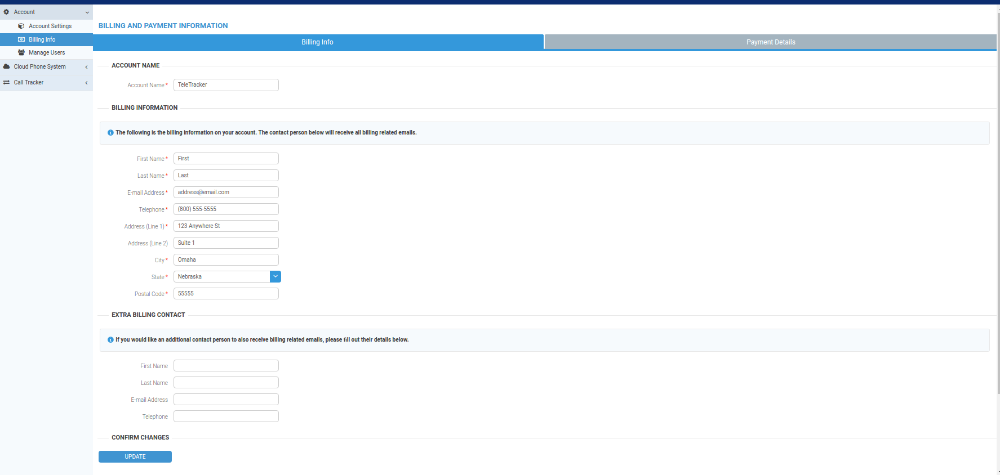

The billing info tab allows users to update their information such as account name, address, etc.

| Name                       | Description                                                     |
| -------------------------- | :-------------------------------------------------------------: |
| Account Name               | Name of the account as showed in the account switcher dropdown. |
| First Name                 | First name of the account holder.                               |
| Last Name                  | Last name of the account holder.                                |
| E-mail Address             | E-mail address of the account holder.                           |
| Telephone                  | Contact phone number for account holder.                        |
| Address (Line 1)           | Street address of the account holder. Should be the billing address of credit card used for payment. |
| Address (Line 2)           | Optional apartment/suite number.                                |
| City                       | City of account holder.                                         |
| State                      | State of account holder. Currently only U.S. states and Canadian Provinces available. |
| Postal Code                | Zip code of the account holder.                                 |

There is also an additional contact form for another person to recieve billing related emails/phone calls.

#### Payment Details Tab

The payment details tab allows users to choose their payment method. If "Mail in Payment" is selected, the address to mail a check to is displayed. If "Credit Card" is chosen and the user has a card on file, the last four digits of the card are displayed. If there is no credit card on file, a form to submit credit card information is displayed.

| Name                       | Description                                                              |
| -------------------------- | :----------------------------------------------------------------------: |
| Card Number                | The credit card number to be charged.                                    |
| CVV Number                 | The cvv of the credit card to be charged.                                |
| Expiration Date            | The expiration date of the credit card to be charged.                    |
| Name on Card               | First and Last name of the credit card holder as it appears on the card. |
| Last Name                  | Last name of the account holder.                                         |
| E-mail Address             | E-mail address of the account holder.                                    |
| Telephone                  | Contact phone number for account holder.                                 |
| Street Address             | Street address of the credit card billing address.                       |
| City                       | City of credit card billing address.                                     |
| State                      | State of credit card billing address. U.S. state or Canadian province.   |
| Postal Code                | Zip code of credit card billing address.                                 |

### Manage Users

The Users module consists of a list of users on the account and the ability to create, edit and delete users.

#### Manage Users List

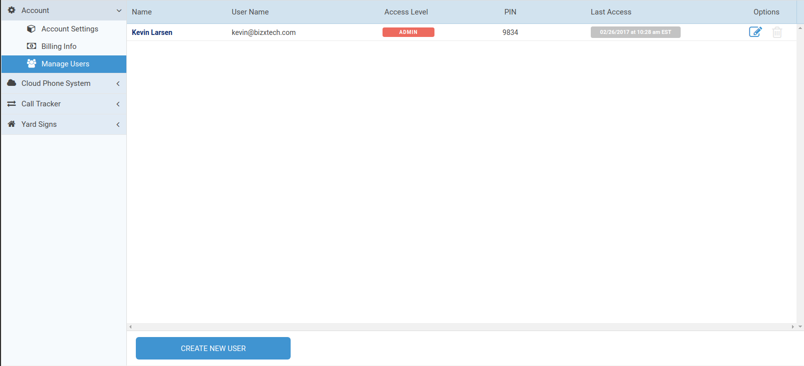

The manage users list is the first page a user sees upon clicking the "Manage Users" menu option. It has all current users set up on the account, and displays name, username (email address), access level, PIN, last access date and options. The options column includes an edit button and a delete button. 

#### Manage Users - Edit view

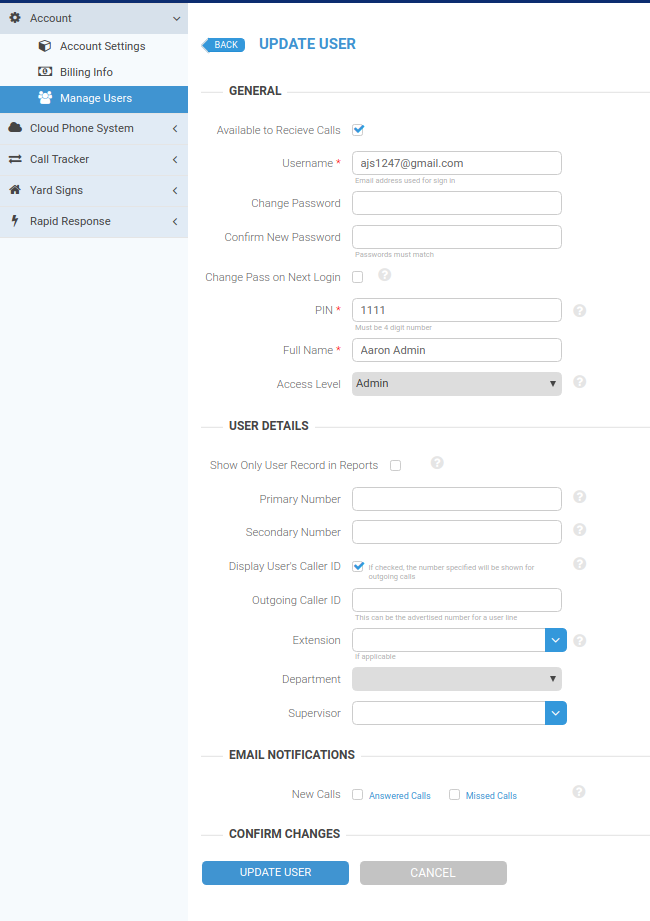

The edit view of the Users module is accessed by clicking the edit button in the options column for that user. It allows Admins and Managers to update the information for users on the account. 

| Name                       | Description                                                              |
| -------------------------- | :----------------------------------------------------------------------: |
| Available to Recieve Calls | Checked if the user is available to take calls.                          |
| Username                   | The email address this user will use for login.                          |
| Change Password            | If a new password is needed, it can be changed here.                     |
| Confirm New Password       | Must match the new password in the "Change Password" field.              |
| Change Pass on Next Login  | Requires the user to change their password next time they log in.        |
| PIN                        | This four digit number is used for call confirmation.                    |
| Full Name                  | First and last name of the user.                                         |
| Access Level *             | The access level of the user.                                            |
| Show Only User Record      | If checked, users can only see their calls in reports.                   |
| Primary Number             | The primary personal phone number of the user.                           |
| Secondary Number           | A secondary number for the user. This is typically their cell phone.     |
| Display User's Caller ID   | Option to display a particular number as the user's caller id.           |
| Outgoing Caller ID         | The number to display as the outgoing caller id.                         |
| Extension                  | If VoIP phones are configured for the account, this will associate calls to that phone with this user. |
| InfusionSoft ID Number     | If the account has InfusionSoft integration enabled, this is their ID number. |
| Department                 | The specific department the user belongs to.                             |
| Supervisor                 | The user's supervisor. Any user on the account can be set as another user's supervisor. |
| New Calls                  | Email notifications will be sent to this user for answered calls and/or missed calls. |

*Note - There are three access levels: View Only, Manager, and Admin. View Only has limited access, and cannot create, modify or delete any information. Managers have access to all parts of the application except for billing functions. Admins have full access to create, modify, or delete any information (including billing info). 

#### Manage Users - Create View

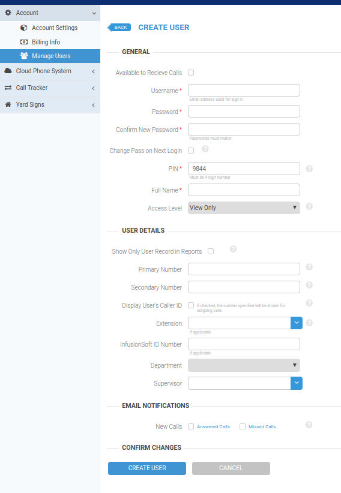

The create user form is accessed by clicking the "Create New User" button at the bottom of the list. It is identical to the Edit form [described above](#manage-users---edit-view). The PIN is automatically generated if the account is configured to auto increment PINs in [Account Settings](#account-settings).  

## Cloud Phone System Module

The Cloud Phone System Module consists of the following parts:

* [General Lines](#general-lines)
* [Yard Sign Lines](#yard-sign-lines)
* [Auto Attendant](#auto-attendant)
* [Business Hours](#business-hours)
* [Manage Audio](#manage-audio)

### General Lines

The General Lines sub-module consists of a list of general lines, a form to create a new line, and a form to edit an existing line. The edit view is accessed via the edit button in the options column of the list, and the create view is accessed by the "Create New General Line" button at the bottom.

#### General Lines List

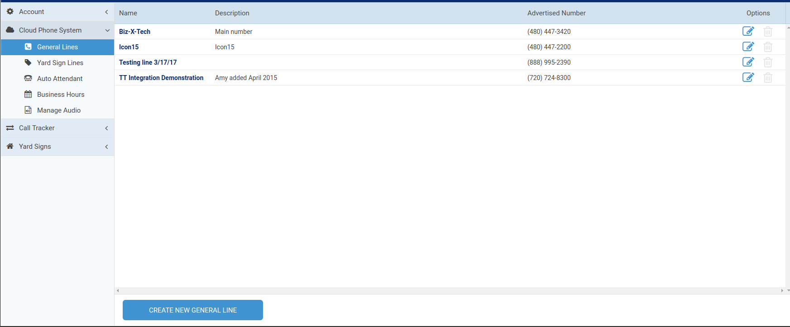

The list has four columns: Name, Description, Advertised Number, and Options. The advertised number is the number that callers will actually dial to reach that line. The options column contains an edit button and a delete button.

#### General Lines Edit View

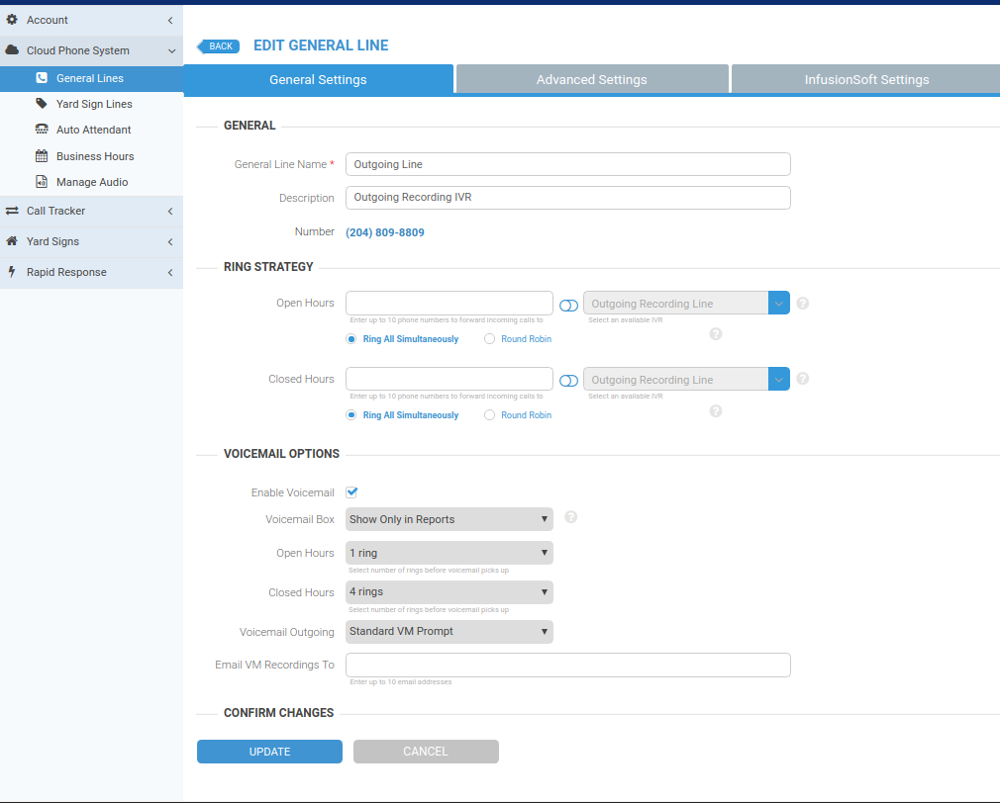

The edit view consists of several tabs. All accounts have "General Settings" and "Advanced Settings" tabs, and accounts with InfusionSoft integration also have a tab for "InfusionSoft Settings".

General Settings

| Name                       | Description                                                              |
| -------------------------- | :----------------------------------------------------------------------: |
| General Line Name          | The name of the line to be displayed throughout the app.                 |
| Description                | A description of this line.                                              |
| Number                     | This is the number users call to reach this line. In the edit view, the number cannot be changed. In the create view, users can choose a number from the list of available numbers. |
| Ring Strategy *            | Sets the ring strategy and default endpoint or an Auto Attendant (IVR)   |
| Enable Voicemail           | Checking this box enables voicemail. If "Straight to Voicemail" is selected, this box cannot be unchecked. |
| Voicemail Box              | By default, voicemail is only accessible through reports. If a SIP phone has a voicemail box configured, the voicemail for this line can show up in that voicemail box as well. |
| Open Hours                 | Number of rings before voicemail picks up during open hours.             |
| Closed Hours               | Number of rings before voicemail picks up during closed hours.           |
| Voicemail Outgoing         | This is the message the caller hears when voicemail picks up. Typically, it would instruct them to leave a message after the beep. |
| Email VM Recordings To     | Up to 10 email addresses can be selected to be notified of voicemails left on the line. The email includes a link to the recording. |

***Note** - In a typical configuration, there are several numbers (up to 10) that will ring when a caller calls this line. These numbers must be non TeleTracker numbers. These numbers can ring all at the same time, or they ring one at a time in a "Round Robin" fashion. Callers can also be sent straight to voicemail, negating the need for forwarding numbers. Alternatively, if an Auto Attendants are set up for the account, callers can be sent to the selected Auto Attendant, which will determine where the call gets forwarded to.

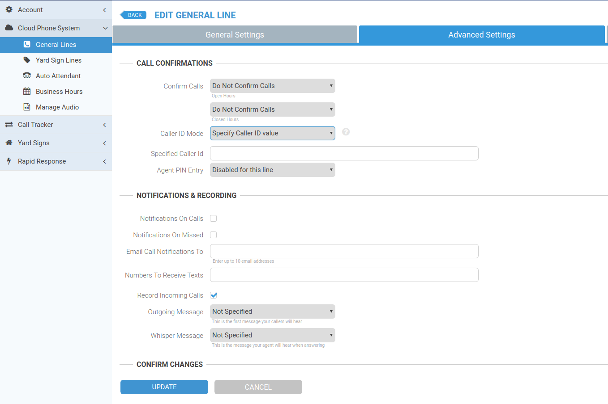

Advanced Settings

| Name                       | Description                                                                                 |
| -------------------------- | :-----------------------------------------------------------------------------------------: |
| Confirm Calls              | Agents answering a call will be prompted for call confirmation.                             |
| Caller ID Mode             | The phone that receives the calls placed to this line will show the specified number on the caller id. It can be passed through from the original caller, it can show up as the line's number, or it can be a custom phone number. |
| Specified Caller ID        | If Specify Caller ID value is selected for the Caller ID Mode, this is where to input the specified number. |
| Agent PIN Entry            | If set, allows calls to be associated with users when they enter their PIN.                 |
| Notifcations On Calls      | The line can send out e-mail or text message notifications on calls. This checkbox sends out on all calls, regardless of whether it was answered or missed. |
| Notifications On Missed    | Notifications are sent out for missed calls only.                                           |
| Email Call Notifications To| Specified email addresses will receive the notifications specified by the above checkboxes. |
| Numbers To Receive Texts   | Text message notifications will be sent to the specified numbers for the notifications checked in the above checkboxes. |
| Record Incoming Calls      | If checked, call recordings will show up in Call Tracker Reports.                           |
| Outgoing Message           | This is the first message callers hear. Typically, it informs the caller that the call will be recorded. |
| Whisper Message            | This message is played for the agent when they answer the phone.                            |

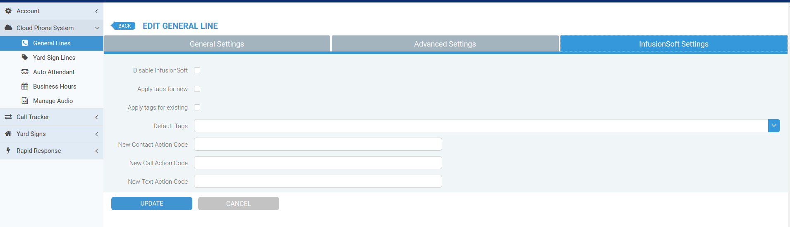

InfusionSoft Settings

| Name                             | Description                                              |
| --------------------------       | :------------------------------------------------------: |
| Disable InfusionSoft             | Turns off InfusionSoft integration for this line.        |
| Apply tags for new contacts      | This will apply the specified tags for new contacts.     |
| Apply tags for existing contacts | Will apply specified tags for existing contacts.         |
| Default Tags                     | Selected tags will be applied to the calls to this line. |
| New Contact Action Code          | Action code for new contacts.                            |
| New Call Action Code             | Action code for new calls.                               |
| New Text Action Code             | Action code for new texts.                               |

#### General Lines Create View

The create view for general lines is the same as the edit view described above.

### Yard Sign Lines

Yard Sign Lines consist of the same components as the General Lines. The difference between General Lines and Yard Sign Lines is that when a user calls a yard sign line, a few specific things happen:

1. The caller hears an outgoing message (which tells them to input the number for the yard sign they'd like to hear about)
2. The caller enters the yard sign number
3. The caller hears a second message (describing the property they are inquiring about)
4. The caller can press 1 to be connected to the number(s) in the Ring Strategy portion of the yard sign line
5. The caller can press 2 to receive a text message about the property (the specifics of the text they receive are defined by the [Yard Signs Module](#yard-signs-module))

Some parts of the above process are determined by the Yard Sign Line settings, and some are determined by the Yard Sign Module settings. The following are the main notable differences between the Yard Sign Line settings and the General Line settings:

* The outgoing message for yard signs **must** prompt the user to enter a yard sign number (the system will just wait for them to enter a number)
* There is no whisper message option for a yard sign line because the whisper message is determined by the yard sign the user selected (set up in the [Yard Sign Module](#yard-signs-module)).

**Note** - There is no way to convert a yard sign line into a general line (or vice versa). If this needs to happen, the line must be deleted, which will free up the number on the account. Then a new general or yard sign line can be created using that number. The settings must be reconfigured after the new line is created.

### Auto Attendant

An Auto Attendant can be set up to answer calls and direct callers to the end point of their choice. One common use case for this is to direct users to various departments within the organization. For example, the auto attendant can be configured to send callers to the Sales department if they press 1, and send them to the Support department if they press 2. It is also common to set 0 to direct to an operator. 

Auto Attendants can be nested. For example, a user presses 1 for Sales, then is presented with the "Sales" auto attendant, which prompts them to press 1 for "Sally", 2 for "Jim", or 3 for "Bob".

The Auto Attendant Module consists of a create view with a guided set up, an edit view, and a list of auto attendants. If there are no Auto Attendants set on the account, the auto attendant module will simply display the guided setup, allowing a user to create an auto attendant step-by-step. 

#### Auto Attendant Guided Set Up

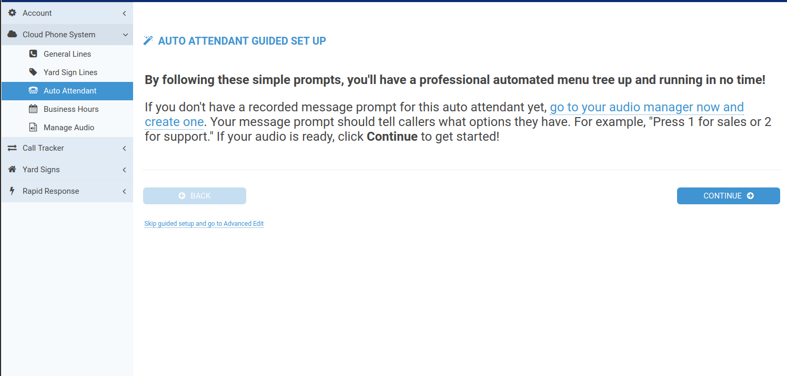

The Auto Attendant guided set up is designed to be self explanatory as a user clicks through the steps. The options available are the same options described in the [Auto Attendant Edit Form](#auto-attendant-edit-form) section.

#### Auto Attendant Edit Form

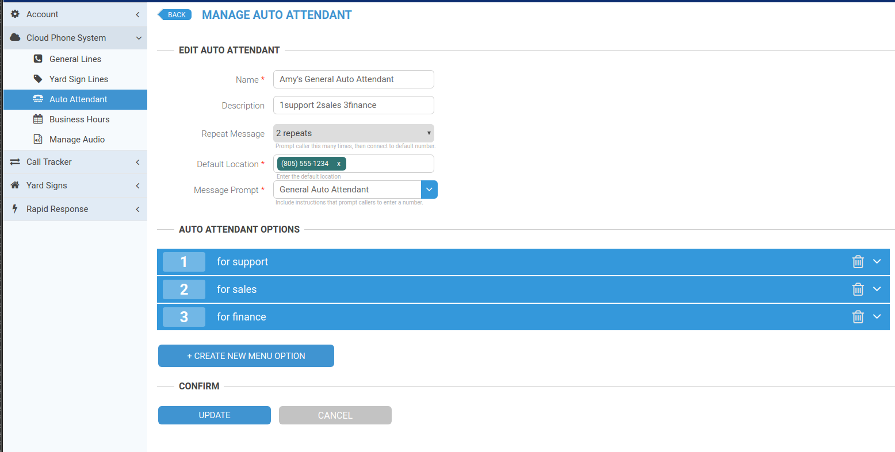

If the "Skip Guided Set Up" is clicked, the user will see the Auto Attendant edit form. This edit form is the same for creating a new auto attendant, or editing an existing auto attendant.

| Name                 | Description                                                                           |
| -------------------- | :-----------------------------------------------------------------------------------: |
| Name                 | The name of this auto attendant.                                                      |
| Description          | Description of the auto attendant.                                                    |
| Repeat Message       | Number of times to repeat the message before sending callers to the default location. |
| Default Location     | Phone to ring if the user does not enter a valid menu option.                         |
| Message Prompt       | The audio message a caller will hear when they call.                                  |

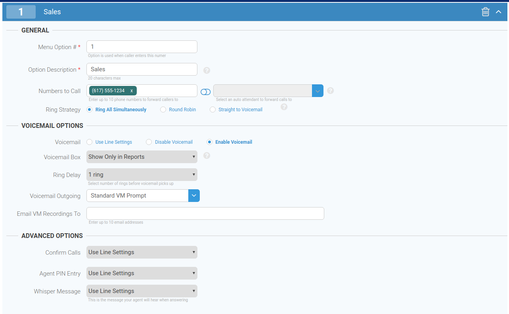

Each menu option has its own configuration which can be seen by clicking on the option from the list in the form. This will expand a sub-form that contains the fields for the menu option. 

| Name                   | Description                                                                 |
| ---------------------- | :-------------------------------------------------------------------------: |
| Menu Option #          | The number the caller presses to get to this option.                        |
| Option Description     | Short description of the option for display in reports.                     |
| Numbers to Call        | The number to ring or auto attendant to forward callers to.                 |
| Ring Strategy          | Ring All, Round Robin, or Straight to Voicemail. Round Robin requires a ring delay to be selected as well. |
| Voicemail              | Use the line settings or override those by enabling/disabling voicemail.    |
| Voicemail Box          | By default, voicemail is only accessible through reports. If a SIP phone has a voicemail box configured, the voicemail for this line can show up in that voicemail box as well.                     |
| Ring Delay             | Number of rings before voicemail picks up.                                  |
| Voicemail Outgoing     | This is the message the caller hears when voicemail picks up. Typically, it would instruct them to leave a message after the beep. |
| Email VM Recordings To | Up to 10 email addresses can be selected to be notified of voicemails left on the line. The email includes a link to the recording. |
| Confirm Calls          | Agents answering a call will be prompted for call confirmation.             |
| Agent PIN Entry        | If set, allows calls to be associated with users when they enter their PIN. |
| Whisper Message        | This message is played for the agent when they answer the phone.            |

#### Auto Attendant List

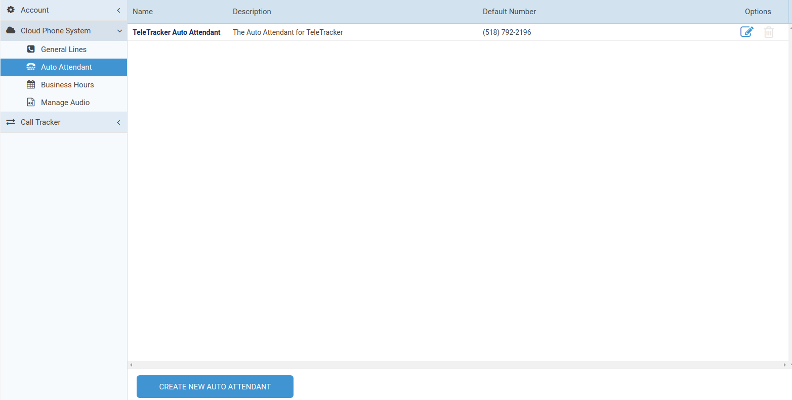

The Auto Attendant list has four columns: Name, Description, Default Number, and Options. The default number is the number the auto attendant will send the caller to in the event they do not enter a valid menu option. The options column contains an edit button and a delete button. Clicking the edit button brings users to the [Auto Attendant Edit Form](#auto-attendant-edit-form). 

The "Create New Auto Attendant" button at the bottom of the list allows a user to create a new auto attendant. This button brings up the [guided set up](#auto-attendant-guided-set-up).

### Business Hours

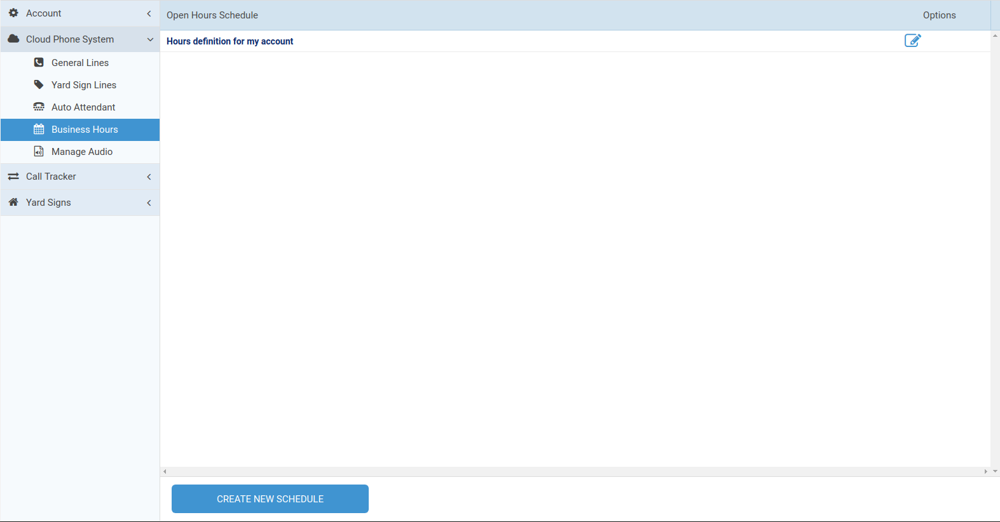

The business hours list has two columns. The first column is the name of the Open Hours Schedule, and the second column is Options. The options column allows you to edit or delete a schedule. The default schedule for the account cannot be deleted, but the name can be changed in the edit view.

#### Business Hours Edit View

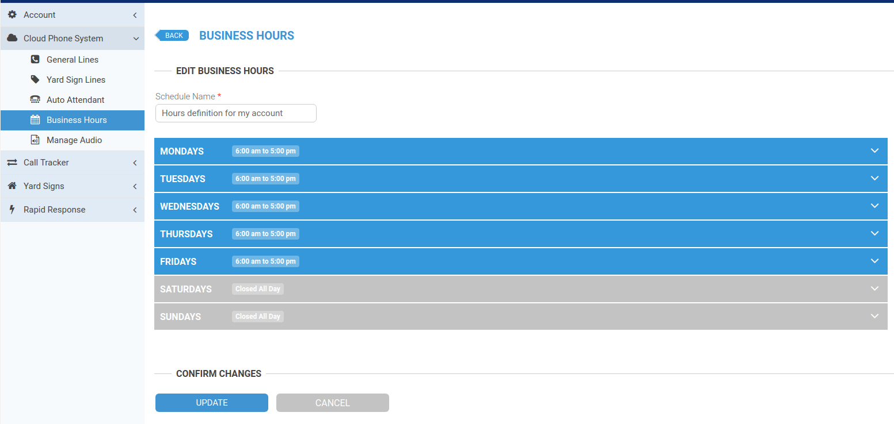

The business hours edit view allows you to choose the name of the Schedule, and set the open hours for each day of the week. Any day of the week that has no open hours is considered closed all day, and is indicated by a grey color (Pro tip: delete all open hours for a given day to set that day to "closed all day"). Days that have open hours are indicated by blue.

Clicking on the day of the week opens up a sub-form that allows you add open hours to that day.

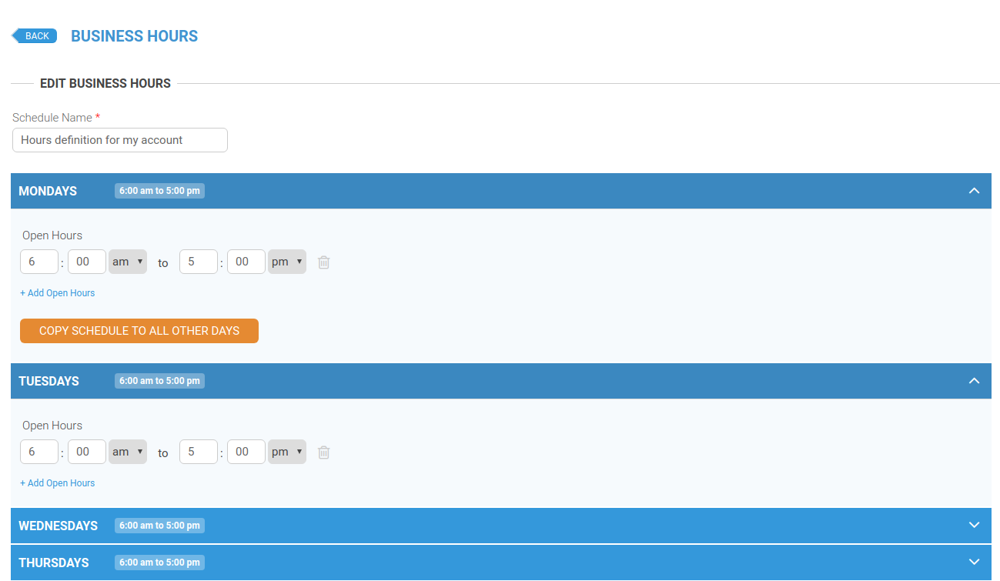

Monday has an extra button to copy the schedule for this day to all other days. Other than that, all days are the same. They feature a link to Add Open Hours, which gives an open and closing time to fill out. This allows for a schedule such as Open in the morning, closed for lunch, then open again in the afternoon. 

When the hours for the schedule have all been chosen, the user must click the "Update" button at the bottom of the form.

#### Business Hours Create View

The create view functions in exactly the same manner as the [Business Hours Edit View](#business-hours-edit-view).

### Manage Audio

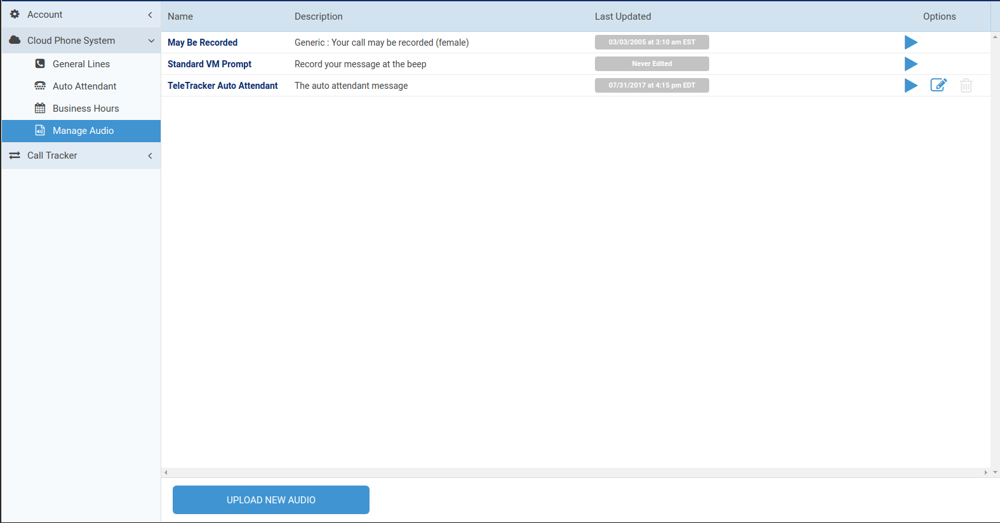

The Manage Audio list has four columns: Name, Description, Last Updated, and Options. The Name for the audio is referenced throughout the app. The last updated date shows when the name, description, or audio file last changed.

The options column includes a play button to listen to the audio, an edit button to update the audio, and a delete button. On every account, there are two audio files that cannot be edited or deleted: "May Be Recorded" and "Standard VM Prompt". These standard messages are used as defaults for outgoing message and the voicemail prompt on a line. All other audio files can be updated and deleted.

At the bottom of a list is a button to upload a new audio file.

#### Manage Audio Edit View

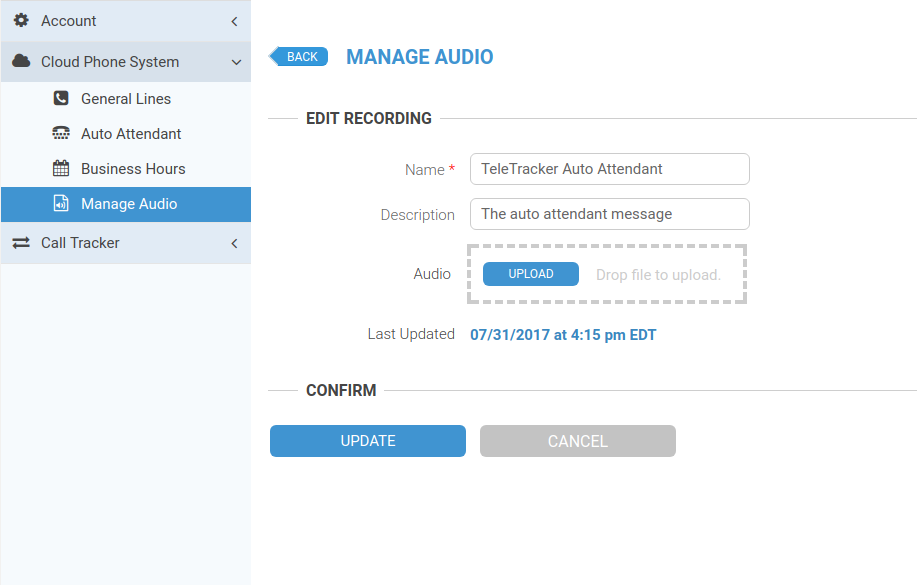

The edit view allows you to change the name and/or description of the audio. If necessary, a new file can be uploaded. To upload an audio file, the user can drag and drop the audio file from their computer. Alternatively, clicking the "Upload" button will open a file picker to let the user select the file from their file system. The "Last Updated" field will be automatically updated every time this form is submitted.

#### Manage Audio Create View

The create view functions in exactly the same manner as the [Manage Audio Edit View](#manage-audio-edit-view). The differences are that an audio file **must** be uploaded when creating a new audio record, and there is no "Last Updated" label.

## Call Tracker Module

The Call Tracker Module consists of the following:

* [Dashboard](#dashboard)
* [Reports](#reports)

### Dashboard

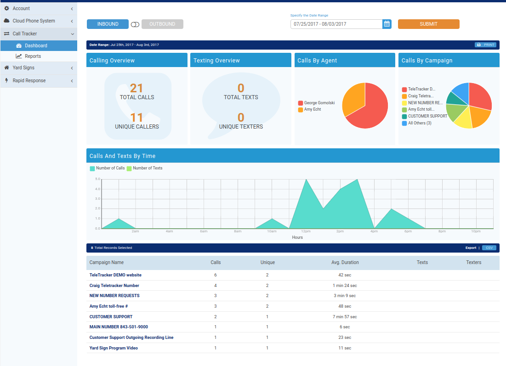

The dashboard provides a high level overview of the calls on the account. When a user navigates to the dashboard, the last seven days of inbound call data is displayed. There is a toggle widget to switch between inbound and outbound data, and there is a date range picker to choose a specific date range. Once a date range is chosen, the user must click submit to see the data for that range. Switching between inbound and outbound automatically gets the data for the chosen range.

The print button allows a user to print the dashboard.

For inbound calling, there are six different statistics displayed: Calling Overview, Texting Overview, Calls By Agent, Calls By Campaign, Calls and Texts By Time, and a datatable of calls by campaign. 

The exact numbers of the calls and texts by time can be seen by hovering your mouse over the peak on the graph, as shown below.

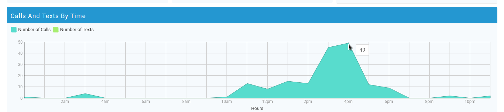

When outbound calling is selected, the calls by campaign widget disappears and the datatable is a breakdown of calls by agent. 

The datatable can be exported to [CSV](http://edoceo.com/utilitas/csv-file-format) by clicking the CSV button. 

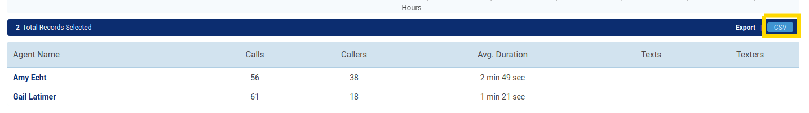

### Reports

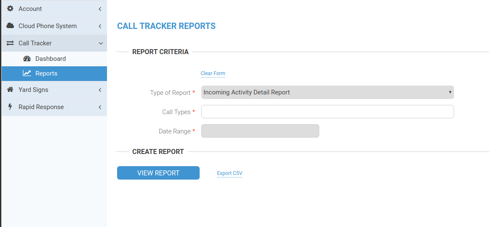

When the user navigates to Call Tracker Reports, a form is displayed to determine the type of report to pull. The "Clear Form" link resets the form back to the default state.

The following report types are available:

* Incoming Activity Detail Report
* Incoming Missed Call Detail Report
* Incoming Activity Detail Report By Campaign
* Incoming Activity Detail Report By Salesperson/Agent
* Incoming Activity Detail Report By Yard Sign
* Outgoing Activity Detail Report
* Rapid Response Activity Detail Report

Users that do not have yard signs enabled on their account do not see the option for the yard sign report. Similarly, if Rapid Response is not enabled on the account, the Rapid Response report is not available.

If the report type is "by Campaign", "by Salesperson/Agent", or "by Yard Sign", an additional field appears on the form. The field allows you to select whichever campaigns, agents, or yard signs to include in the report. To the right of the fields are "select all" and "deselect all" buttons.

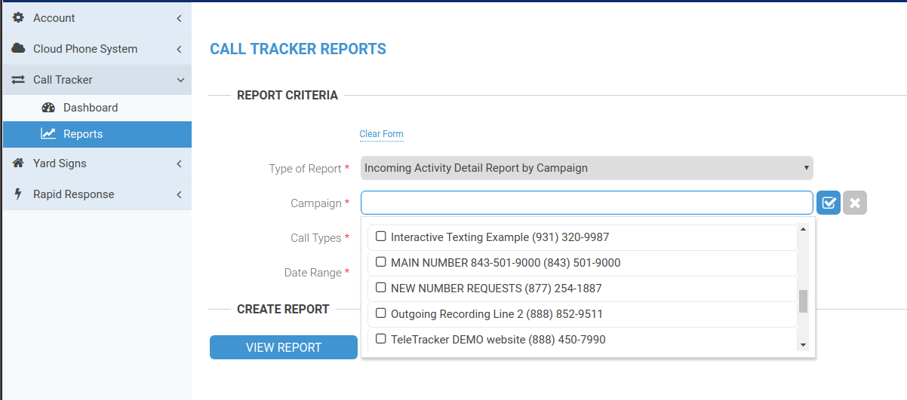

The available call types are:

* Voice Calls
* Text Messages

The date range picker is similar to the one in the [dashboard](#dashboard), but features buttons for common date ranges. These options are:

* Today
* Yesterday
* Last 7 Days
* This Month
* Last Month
* Last 3 Months

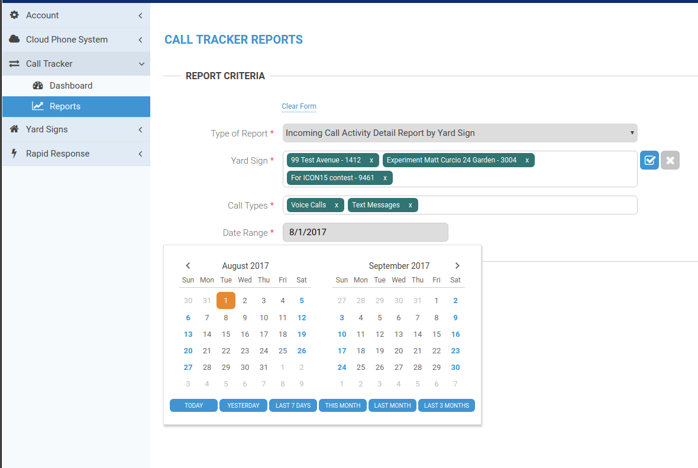

Once all the required fields are filled out the user clicks the submit button to view the report. Alternatively, the user can click the "Export CSV" link to download a CSV of the report data without viewing it in the browser.

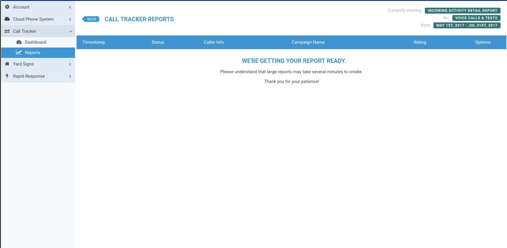

The user is then directed to the reports view. The back button at the top allows the user to jump back and forth between the form and the reports views. At the top right, the type of report, call types and date range is displayed to easily see which report is currently being viewed. A message is displayed as a placeholder while the report is being generated.

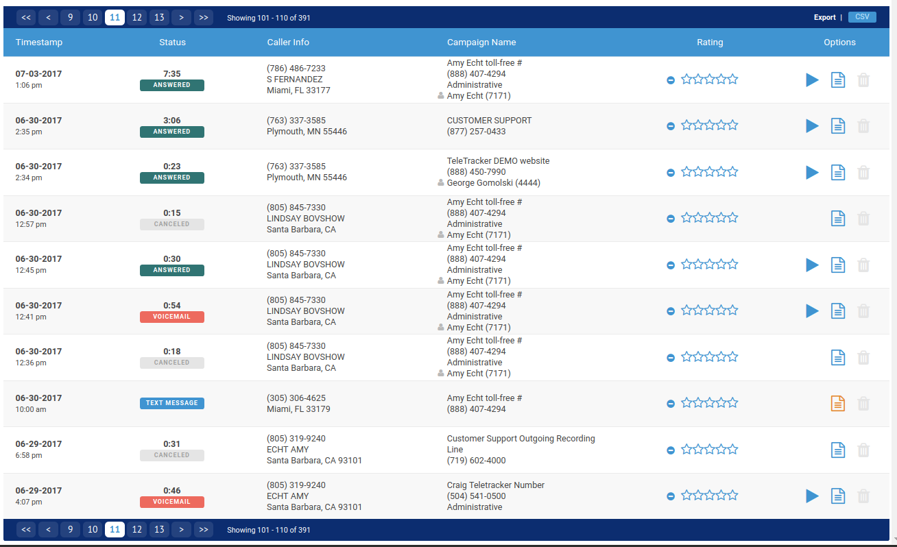

By default, the reports are sorted by date, with the most recent on top. Clicking the header for "Timestamp" allows users to reverse the order and sort by oldest on top.

Reports can also be sorted by campaign by clicking the Campaign Name header.

There are six columns in the reports:

* Timestamp
* Status
* Caller Info
* Campaign Name
* Rating
* Options

The Timestamp column displays the date and time the call began. 

The Status column has the duration of the call and the disposition. There are four dispositions for voice calls: Answered, Missed, Canceled and Voicemail. Missed, Canceled, and Voicemail all show in the Incoming Missed Call Detail Report. Text messages do not have a duration nor a disposition.

The Caller Info column shows all information available on the caller. Typically, it will be the phone number they called from, the person's name, and the city, state and zipcode of the phone number. If the caller called from a restricted number, "Unknown Phone Number" will be displayed as the caller info.

The Campaign Name column shows the information about the campaign. For an incoming call, this will include the name and number of the line that was called. For an outgoing call, it will indicate that it was outgoing and include the number the call was initiated from. If an agent was associated with the call, it will have a user icon, followed by the name of the agent and their PIN in parentheses. If the call was associated with a yard sign, the name and number of the yard sign the user chose will be displayed.

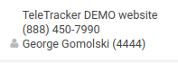 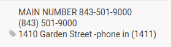

The Rating column allows the user to give the call a rating between 1 and 5 stars. The minus circle icon to the left of the stars clears the rating.

The Options column contains a play button (if there is a recording available), a note button and a delete button. The play button will pop up an audio player that will play the recording.

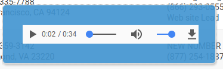

Clicking the note button will reveal a sub view in the datatable. This sub view contains any call notes for the call, as well as options for emailing the call notes and a link to the call recording (if applicable). When a call contains a note, the note button is orange instead of blue. All text messages contain a call note that says "TEXT: {$message}" where `$message` is the message that was sent. Voice calls do not contain notes by default. All notes can be edited and saved from this form. For the email portion, users can select recipients from the list of users on the account or can type in an email address. Typed emails are considered "External Recipients". 

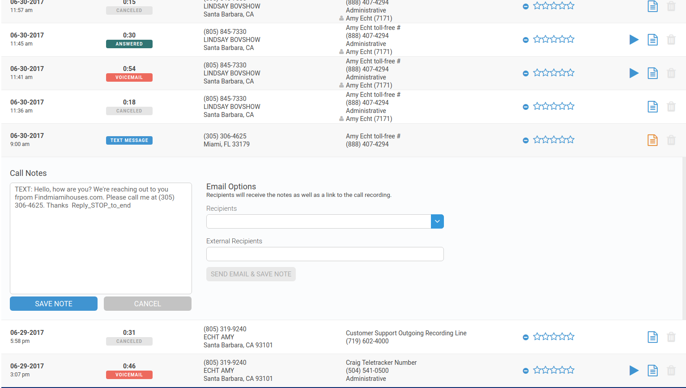

## Yard Signs Module

The Yard Signs Module is composed of a list of Yard Signs for the account, as well as a form to create or edit yard signs.

* [Yard Sign List](#yard-sign-list)
* [Yard Sign Form](#yard-sign-form)

### Yard Sign List

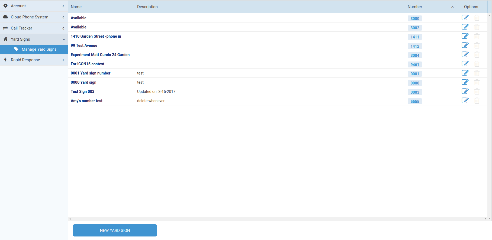

The Yard Sign List has four columns: Name, Description, Number and Options. By default, the list is sorted by name, but it can also be sorted by yard sign number by clicking the "Number" header. The options column contains edit and delete buttons. The edit button brings you to the [Yard Sign Form](#yard-sign-form). The delete button removes the yard sign. Below the list there is a button to create a new yard sign.

### Yard Sign Form

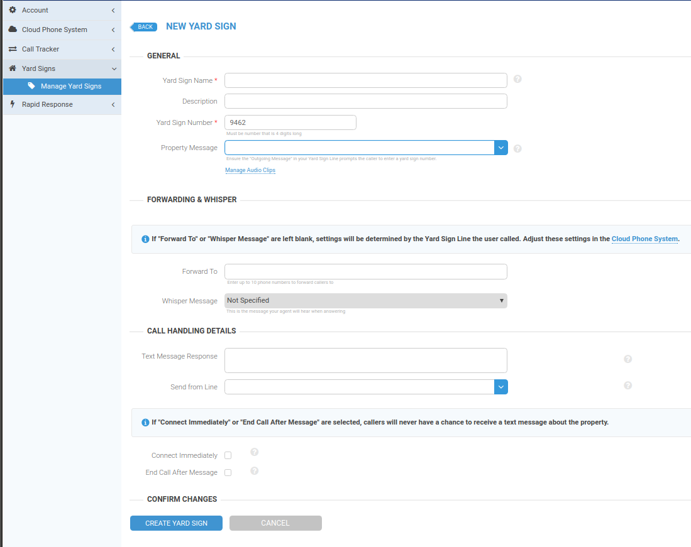
 
The Yard Sign form allows you to create or modify a Yard Sign. When creating a new yard sign, the yard sign number is automatically incremented from the largest yard sign number used. For example, if your first yard sign number was 3000, the generated number will be 3001.

**NOTE:** If the Text Message Response field is left blank, and the user elects to receive a text about the yard sign, the text will contain the Yard Sign Name and Description. Please ensure that these are accurate or that Text Message Response is filled out.

| Name                   | Description                                                                           |
| --------------------   | :-----------------------------------------------------------------------------------: |
| Yard Sign Name         | The name of this yard sign.                                                           |
| Description            | Description of the yard sign.                                                         |
| Yard Sign Number       | The number the caller must enter to listen to this property message.                  |
| Property Message       | The message that will play for callers that enter this yard sign number.              |
| Forward To             | The numbers that will ring when users elect to be connected.                          |
| Whisper Message        | The message the agent will hear when answering.                                       |
| Text Message Response  | The message that will be sent to the caller if the callers elect to receive a text.   |
| Send From Line         | The phone number that texts will appear to come from when callers receive texts.      |
| Connect Immediately    | Connects the users to the numbers in Forward To as soon as the property message finishes playing. |
| End Call After Message | Ends the call after the property message plays instead of sending the caller to the Forward To numbers. |

## Rapid Response Module

Rapid Response is a system where a customer navigates to a website and submits a form indicating that they would like to be contacted. The system automatically connects the customer to the agents by calling the agents and then calling the customer. The user can define the order in which agents are called and how long to dial them for by configuring a [Call Process](#rapid-response-call-process).

The Rapid Response Module consists of the following:

* [Dashboard](#rapid-response-dashboard)
* [Users](#rapid-response-users)
* [Groups](#rapid-response-groups)
* [Call Process](#rapid-response-call-process)

### Rapid Response Dashboard

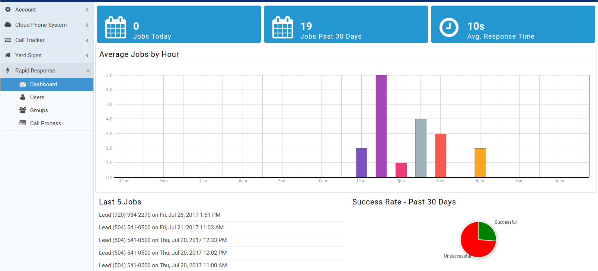

The Rapid Response Dashboard provides a high level overview of the Rapid Response activity for the account. Displayed at the top are the number of jobs today, number of jobs for the past 30 days, and average response time. Next is a chart of Average Jobs by Hour which shows the time of day jobs were completed over the last 30 days. At the bottom of the page, the last 5 jobs completed are displayed next to a pie chart of Success Rate for the past 30 days. 

### Rapid Response Users

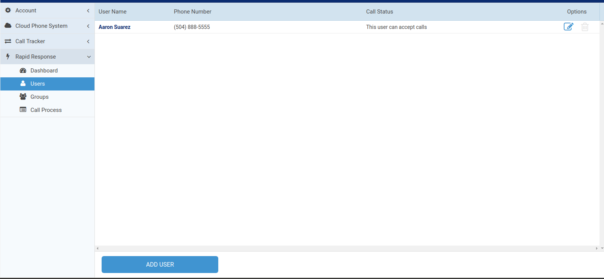

For Rapid Response to work, users must be set up to accept calls. The users are displayed in a list with four columns: User Name, Phone Number, Call Status, and Options. Call Status can be changed at any time for any user to enable or disable that user. The Options column provides an edit button to edit the user and a delete button to delete the user. Below the list is a button to add a new user.

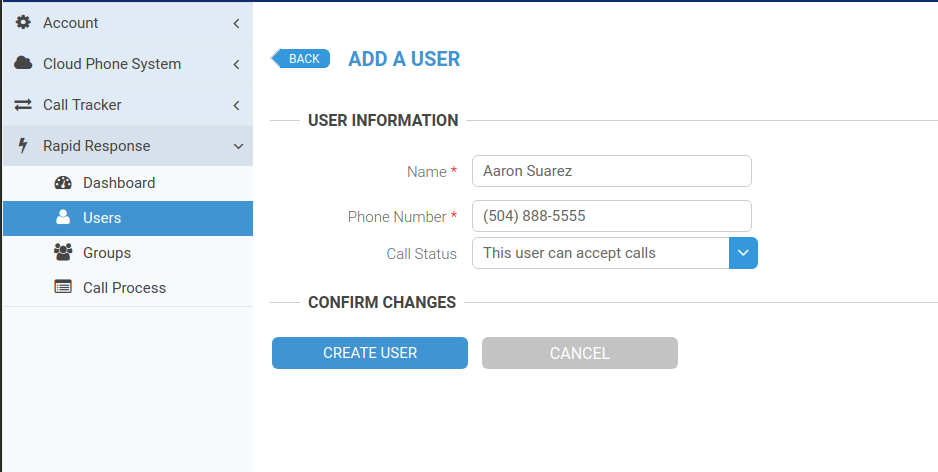

The Rapid Response User form allows users to add or update a Rapid Response User's name, phone number, and call status. 

| Name           | Description                                              |
| -------------- | :------------------------------------------------------: |
| Name           | The name of the user.                                    |
| Phone Number   | The phone number for this user.                          |
| Call Status    | Users can be enabled or disabled through this selection. |

### Rapid Response Groups

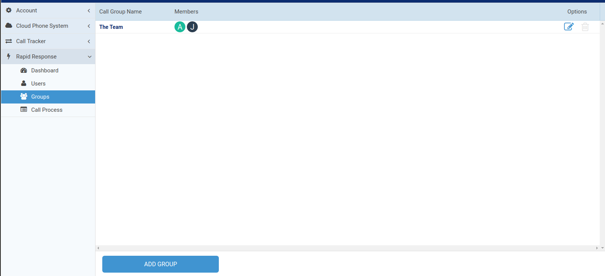

Rapid Response Groups are used to call a specific group of users all in one step. The users are called all at once and whichever agent accepts first gets the call. Groups can include as many users as needed. The Group list has three columns: Call Group Name, Members, and Options. The Options column contains an edit button and a delete button. Below the list is a button to add a new group.

Pro tip: hovering over an icon in the Members column shows the full name of that user.

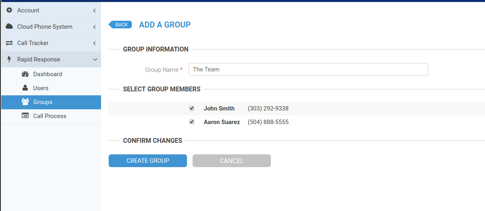

The Rapid Response Group Form allows a user to name the group, and check whichever members should be included in the group.

| Name                   | Description                                  |
| --------------------   | :------------------------------------------: |
| Group Name         | The name of the group.                           |
| Group Members      | All checked members will be a part of the group. |

### Rapid Response Call Process

When a Rapid Response call is initiated, it will follow the specified call process. A call process determines which users will be called and the order in which to call them.

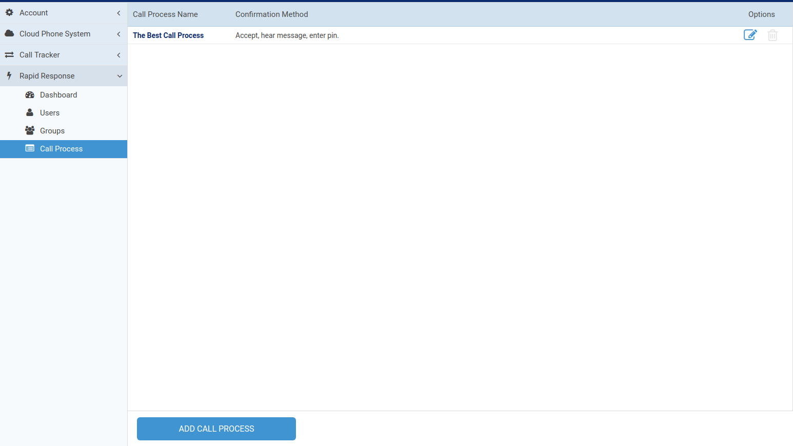

The Rapid Response Call Process List has three columns: Call Process Name, Confirmation Method, and Options. When a rapid response call occurs, the user will hear a message about the lead and will need to decide whether to accept the call or not. The Confirmation Method determines whether the agent should accept the call before they hear the message, or vice versa. The Options column includes edit and delete buttons to edit and delete the call processes. Below the list is an add call process button for creating a new call process.

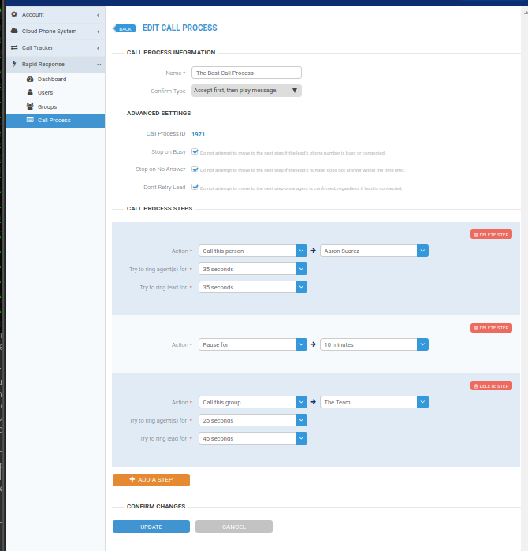

The Rapid Response Call Process consists of a number of steps which will be executed in order when the call happens. A step can either call a Rapid Response User, call a Group, or pause for a certain amount of time. 

| Name               | Description                                                                                        |
| -----------------  | :------------------------------------------------------------------------------------------------: |
| Name               | The name of the call process.                                                                      |
| Confirmation Type  | The order to play the message and accept the call.                                                 |
| Call Process ID    | The ID of this call process. Used to specify which call process to follow for a given lead source. |
| Stop on Busy       | Do not attempt to move to the next step if the lead's phone number is busy or congested.           |
| Stop on No Answer  | Do not attempt to move to the next step if the lead's number does not answer within the time limit.|
| Don't Retry Lead   | Do not attempt to move to the next step once agent is confirmed, regardless if lead is connected.  |
| Call Process Steps | The steps that will happen when this call process is triggered. Call a person, a group, or pause.  |

